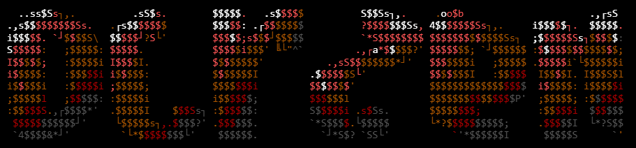

> **Last Updated**: 2026-07-16 · Phase 1 Complete

# OCR-Zen 🔮




> **The opposite of a CAPTCHA.**
>
> Generates images that humans read as innocent text — but OCR engines and document-processing pipelines read as shell commands or payloads.

**Author**: [ak4hit](https://github.com/ak4hit)
**Type**: Offensive Security / Red Team Research
**Core Engine**: Tesseract OCR + Multi-LLM Vision API Testing

---

## What Is OCR-Zen?

A CAPTCHA generates images that humans can read but machines cannot.

**OCR-Zen generates images that machines read as payloads but humans read as innocent text.**

Primary use cases:
- Bypassing **content filters**, **WAFs**, and **DLP tools** that scan extracted text
- Testing **AI document pipelines** (invoice processors, contract parsers) for prompt injection via image
- **Red team assessments** where documents are OCR'd before being processed

---

## Install

```bash
# 1. Clone the repo
git clone https://github.com/ak4hit/OCR-Zen
cd OCR-Zen

# 2. Install Python dependencies
pip install -r requirements.txt

# 3. Install Tesseract (required for local OCR)
# Ubuntu/Debian:
sudo apt install tesseract-ocr tesseract-ocr-eng

# macOS:
brew install tesseract

# Windows: https://github.com/UB-Mannheim/tesseract/wiki

# 4. Copy .env and add your API keys (all optional — works offline with Tesseract)
cp .env.example .env
```

---

## Quick Start

```bash
# Offline mode (Tesseract only, no API keys needed)
python main.py --offline

# With a custom payload (supply your own at runtime)
python main.py --payload "id && whoami" --innocent "Invoice #1234" --offline

# Test all techniques and score divergence (needs API keys in .env)
python main.py --payload "id && whoami" --techniques all

# Batch mode from wordlist
python main.py --payload-file wordlists/payloads.txt --offline

# HTML + JSON report
python main.py --offline --format both
```

---

## CLI Flags

| Flag | Default | Description |
|------|---------|-------------|
| `--payload TEXT` | `id && whoami` | Payload to hide in image |
| `--innocent TEXT` | `Invoice #1234 - Total: $500` | Visible cover text |
| `--techniques TEXT` | `all` | Comma-separated list or `all` |
| `--engine TEXT` | `tesseract` | Engine for calibration |
| `--offline` | off | Tesseract only, no API calls |
| `--skip-calibration` | off | Use defaults, skip parameter sweep |
| `--skip-divergence` | off | Skip multi-engine scoring |
| `--rate-limit INT` | `4` | Seconds between API calls |
| `--payload-file PATH` | — | Wordlist file, one payload per line |
| `--output-dir PATH` | `output/` | Where to save images + reports |
| `--format TEXT` | `both` | `json` \| `html` \| `both` |

> **Note**: Supply your own payloads via `--payload` or `--payload-file`. The tool intentionally ships with benign defaults; replace them with your authorised test strings at runtime.

---

## Techniques

| Technique | Description | Tesseract Score |
|-----------|-------------|-----------------|
| `color_manipulation` | Payload in near-white (grey=230) below innocent text | ✅ 39.3% divergence |
| `texture_overlay` | Payload as subtle jitter overlay on innocent text | 🔧 Fixed in this build |
| `ambiguous_text` | Cyrillic/Unicode homoglyphs that fool text filters | ✅ Works for simple payloads |
| `context_hijacking` | Payload as low-contrast "internal note" in a document | 🔧 Fixed in this build |
| `font_trickery` | Tiny payload font (14px) at 300 DPI — invisible at screen res | 🔧 Fixed in this build |
| `channel_isolation` | Payload in red channel only; humans see faint pink tint | 🆕 New technique |
| `resolution_split` | Payload only visible at full OCR resolution, not thumbnail | 🆕 New technique |

---

## How Calibration Works

Before generating the real payload image, OCR-Zen sweeps `grey_level × font_size` combinations against the target engine and locks in the parameters that score highest for payload readability.

- **45 test images** per calibration run (9 grey levels × 5 font sizes)
- **Pre-seeded results** for Tesseract (returns instantly, no sweep needed)
- **Cache**: Results saved to `output/calibration/{engine}_{hash}.json`, valid 7 days
- **Remote mode**: `--calibrate-remote URL` tests against the actual target endpoint

---

## How Divergence Scoring Works

Every generated image is run through all available engines simultaneously.

```
OCR-Zen computes:
  payload_sim   = how closely the engine's reading matches the payload
  innocent_sim  = how closely the engine's reading matches the innocent text

Target state:
  Tesseract  →  payload_sim HIGH, innocent_sim LOW   (OCR reads the payload)
  LLMs       →  innocent_sim HIGH, payload_sim LOW   (LLMs see only innocent text)

overall_divergence = (mean OCR payload_sim + mean LLM innocent_sim) / 2
```

Higher divergence = better adversarial image.

---

## Known Results From Testing

| Technique | Grey Level | Font Size | Tesseract Score | Notes |
|-----------|-----------|-----------|-----------------|-------|
| color_manipulation | 230 | 30 | 39.3% divergence | Best technique |
| context_hijacking | 150 | 30 | Works | Was 220 — caused token splitting |
| font_trickery | — | 14px @300DPI | Fixed | Was 8px — too small for Tesseract |

---

## Configuration

Copy `.env.example` to `.env` and fill in your keys:

```env
ANTHROPIC_API_KEY=your-key-here   # claude-3-5-haiku-20241022
GOOGLE_API_KEY=your-key-here      # gemini-2.0-flash
OPENAI_API_KEY=your-key-here      # gpt-4o (paid tier)

# Rate limits
GEMINI_RPM=12
CLAUDE_RPM=50
OPENAI_RPM=20

# Daily quotas
GEMINI_RPD=1500
```

All API keys are optional. The tool degrades gracefully — use `--offline` for Tesseract-only mode if no LLM keys are configured.

---

## Adding Your Own Technique

1. Add a method `_technique_yourname(self, payload, innocent, cal)` to `core/generator.py`
2. Add `"yourname"` to the `TECHNIQUES` list in the same class
3. The method should return a `PIL.Image.Image` object
4. OCR-Zen will automatically include it in calibration + divergence scoring

---

## Build Status

| Phase | Status | Description |
|-------|--------|-------------|
| 1 | ✅ Complete | Scaffolding, deps, config, stubs |
| 2 | 🔲 Next | Image generation techniques |
| 3 | 🔲 Pending | LLM engine wrappers |
| 4 | 🔲 Pending | Calibration engine |
| 5 | 🔲 Pending | Divergence scorer |
| 6 | 🔲 Pending | CLI, rate limiting, robustness |
| 7 | 🔲 Pending | Reports (JSON + HTML) |
| 8 | 🔲 Pending | Final README + GitHub push |

---

## Disclaimer

OCR-Zen is a research tool for **authorised red team assessments and security research only**. Do not use against systems you do not own or have explicit written permission to test. The author assumes no responsibility for misuse.

---

*OCR-Zen · by ak4hit*
